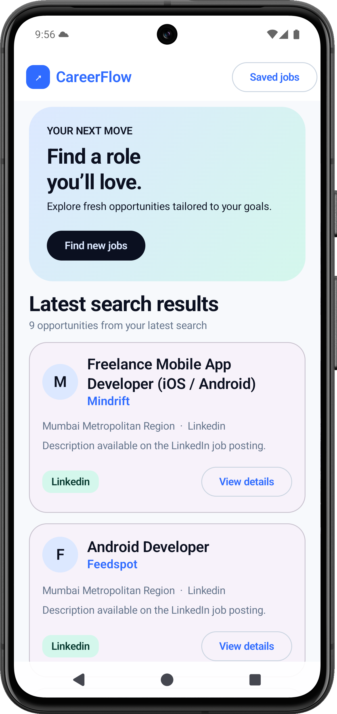
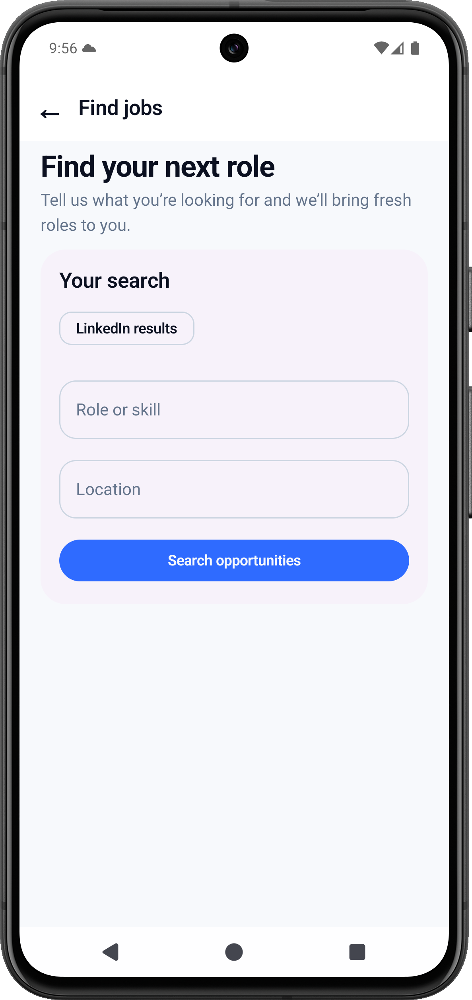
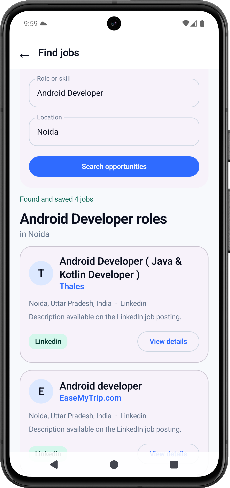
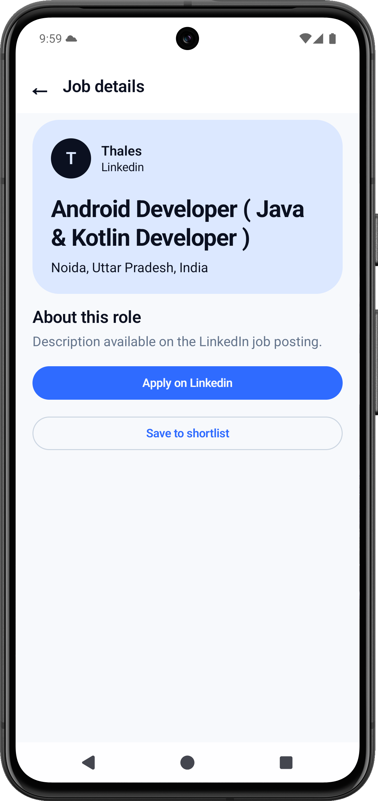
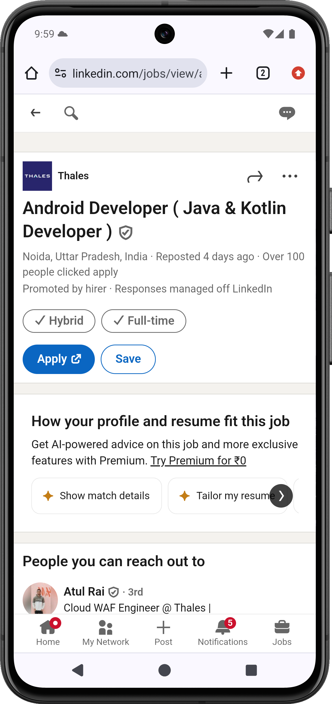
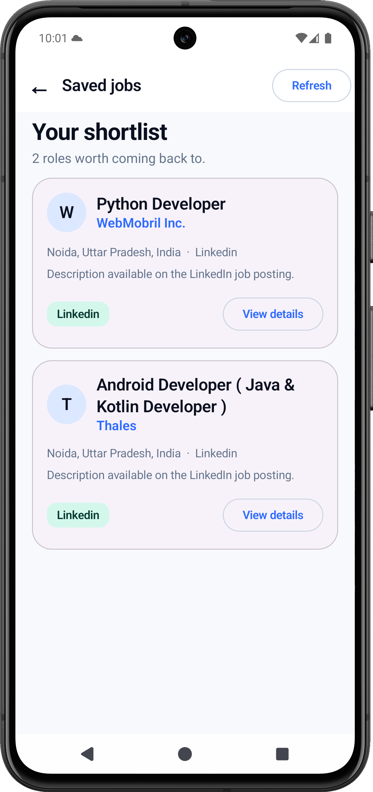
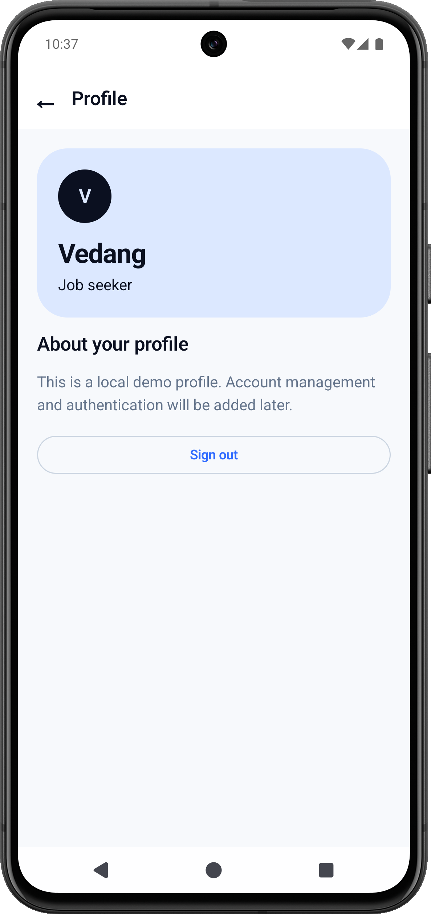
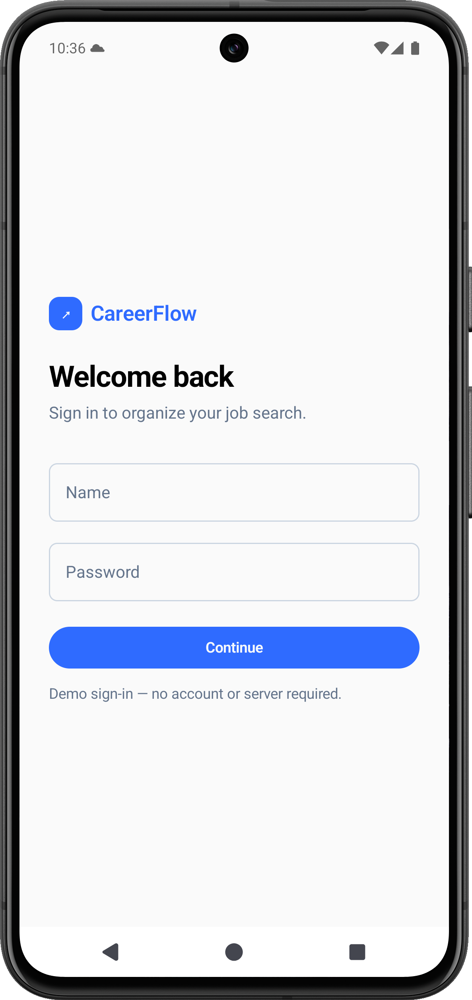

# CareerFlow

CareerFlow is a full-stack job-search companion: an Android app for discovering roles, saving a shortlist, and following applications, backed by a FastAPI service that searches public job listings and stores the results locally.

## Screenshots

The screens below appear in the same order as the app flow captured in the supplied screenshots.

| Home | Find jobs |
| --- | --- |
|  |  |
| Search results | Job details |
|  |  |
| Apply on LinkedIn | Saved jobs |
|  |  |
| Profile | Login |
|  |  |

## What it includes

### Android app

- Animated splash screen with CareerFlow branding
- Local demo login — no account or authentication server required
- Job search by role and location
- Latest-search Home feed, so previous searches do not mix with new results
- Job details with an apply link and a saved-jobs shortlist
- Application Tracker for Applied, Interview, Rejected, and Offer stages
- Basic local profile with sign out
- Responsive Compose UI with clear buttons, accessible back navigation, loading, empty, and error states

### FastAPI backend

- Searches public LinkedIn and Indeed listings for the submitted role and location
- Stores discovered jobs, saved jobs, and application records in SQLite
- Removes old unsaved results on a new search while retaining saved jobs
- Provides REST endpoints for job discovery, tracking, and application tracking

## Screens

| Screen | Purpose |
| --- | --- |
| Login | A simple local demo sign-in screen. |
| Home | Shows results from the latest job search. |
| Find jobs | Searches openings by role and location. |
| Saved jobs | Keeps the user's shortlisted roles. |
| Application Tracker | Summarises Applied, Interview, Rejected, and Offer applications. |
| Profile | Displays the local demo profile and sign-out action. |

## Project structure

```text
Job-Tracker/
├── android/                    # Android / Jetpack Compose app
│   └── app/src/main/java/.../
│       ├── data/               # Retrofit API client and repository
│       ├── model/              # App models
│       ├── ui/                 # Screens, components, navigation, theme
│       └── viewmodel/          # Screen state and UI logic
├── backend/                    # FastAPI service
│   ├── main.py                 # API entry point
│   └── app/
│       ├── api/                # Job and application endpoints
│       ├── models/             # SQLModel tables
│       ├── scrapers/           # LinkedIn and Indeed search clients
│       └── services/           # Job and application logic
├── docs/images/                # README screenshots
└── README.md
```

## Run locally

### Prerequisites

- Python 3.10+
- Android Studio with an Android emulator (or a physical Android device)
- Java is provided by Android Studio for Android builds

### 1. Start the backend

From the project root:

```bash
python3 -m venv venv
source venv/bin/activate
pip install -r backend/requirements.txt
python -m uvicorn backend.main:app --reload
```

The API is available at [http://localhost:8000/docs](http://localhost:8000/docs).

### 2. Run the Android app

1. Open the `android` folder in Android Studio.
2. Start an Android emulator.
3. Run the `app` configuration.

The emulator uses `http://10.0.2.2:8000/` to reach the backend running on the development computer. For a physical phone, update `BASE_URL` in [`RetrofitClient.kt`](android/app/src/main/java/com/Vedang/careerflow/data/api/RetrofitClient.kt) to the computer's local-network IP address.

## API overview

| Method | Endpoint | Description |
| --- | --- | --- |
| `POST` | `/api/jobs/scrape/` | Searches and saves jobs for a role and location. |
| `GET` | `/api/jobs/` | Lists stored jobs. |
| `GET` | `/api/jobs/search/` | Filters jobs by keyword, location, or source. |
| `GET` | `/api/jobs/tracked/` | Lists saved jobs. |
| `POST` | `/api/jobs/{jobId}/toggle/` | Saves or removes a job from the shortlist. |
| `GET` | `/applications` | Lists application records for the Application Tracker. |

## Configuration

Optionally create a `.env` file in the project root:

```env
DATABASE_URL=sqlite:///./job_tracker.db
INDEED_BASE_URL=https://www.indeed.com
LINKEDIN_BASE_URL=https://www.linkedin.com/jobs
MAX_JOBS_PER_SEARCH=50
```

## Notes

- The login and profile are intentionally local-only placeholders; no credentials are sent to the backend.
- Public job sites can change their page structure or limit automated requests. A search may occasionally return no results.
- SQLite data is stored locally and is not shared externally.

